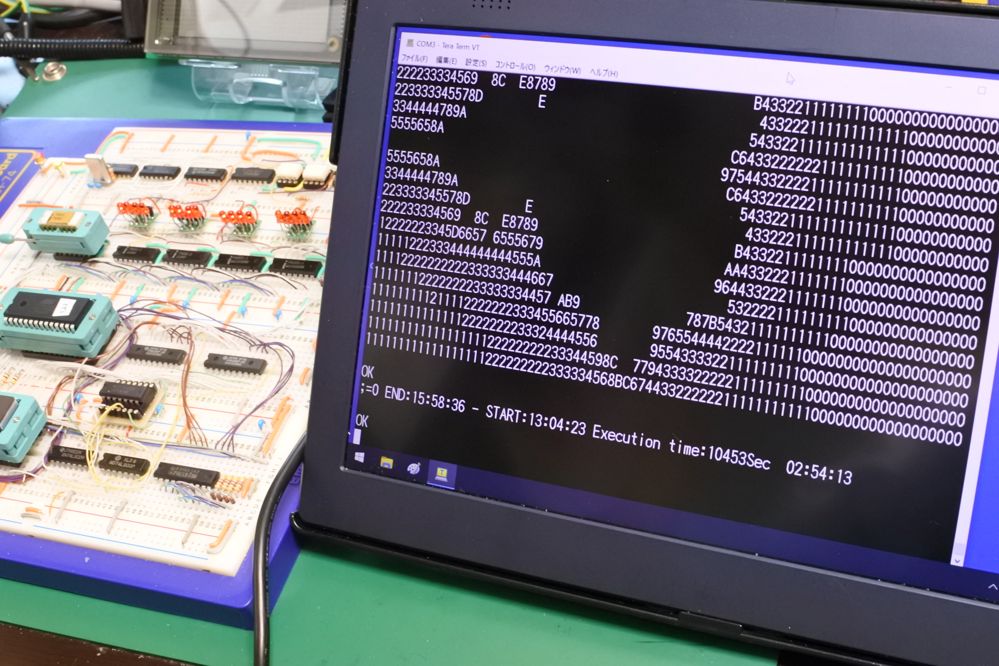

# VTL4004
VTL Interpreter for Intel 4004 Evaluation Board

This document is written mostly in Japanese.
If necessary, please use a translation service such as DeepL (I recommend this) or Google.

## 概要
自作の4004実験用ボードと，その上で動作するVTLインタプリタです．

## 主な仕様

|項目|内容|備考|
|------|----------|---|
|CPU|Intel 4004|
|サイズ|約3.5KB|簡易モニタを含む|
|行番号| 1〜32766|32767はSTOP用|
|コメント|;=0 STR|偽の条件文で行末までスキップするのを利用|
|単純変数|A-Z|a-zも書けるが大文字小文字を区別しない|
|単純変数ビット数|16||
|単純変数範囲|-32768〜32767||
|16進定数|0xxxx|0で始まる数値|
|配列|未実装||
|数値入力|A=?||
|数値出力|?=e||
|数値出力16進2桁|?$=e||
|数値出力16進4桁|??=e||
|文字入力|A=$||
|文字出力|$=e||
|文字列出力|?="STR"||
|改行|?=""||
|改行の阻止|;||
|GOTO|#=e||
|GOSUB|!=e|1段のみ|
|RETURN|#=!||
|STOP|#=32767||
|IF|;=||
|LIST|0||
|式の優先順位|無()||
|算術演算子|+-*/||
|単項演算子|-||
|比較演算子|=<>|>は>=の意味(オリジナルのVTLと同じ)|
|システム(return address)| !||
|システム(剰余)| %||
|システム(行番号)| #||
|システム(乱数)|'|未実装|
|実行| #=1||

### その他の未実装な機能
- 行の編集(挿入，削除等)
  - 最初から行番号昇順のプログラムを入力が前提

### 実装しようと思ったけどペンディング
- PEEK(@(address)右辺)
- POKE(@(address)左辺)
- 乗算の上位16bit

## 実験用ボードの仕様
- CPU: Intel 4004
- Clock: 740kHz
- DATA RAM: 4002-1 x 2 + 4002-2 x 2 (計320bit x 4)
- Program Memory
  - ROM: AT28C64B (8k x 8bit EEPROM)
    - 000H〜EFFHの3.75KB利用可能
  - RAM: HM6268(4k x 4bit SRAM)x 2個
    - 物理メモリ F00H〜FFDHの254byte x 16バンク
      (上記を論理メモリ 000H〜FDFHにマッピングしてアクセスします．)
- 通信ポート: 9600bps Software Serial UART (TTL level)

## ToDO
- プリント基板作成

## 動画
Youtubeで関連動画を公開しています．
- https://www.youtube.com/@ryomukai/videos

## ブログ
関連する情報が書いてあるかも．
- https://blog.goo.ne.jp/tk-80

## 参考にした文献，サイト
### VTL関連
-

### 4004関連開発事例
- [Intel 4004  50th Anniversary Project](https://www.4004.com/)
  - https://www.4004.com/busicom-replica.html
  - http://www.4004.com/2009/Busicom-141PF-Calculator_asm_rel-1-0-1.txt
- https://github.com/jim11662418/4004-SBC
- https://www.cpushack.com/mcs-4-test-boards-for-sale
- https://github.com/novi/4004MainBoard

### データシート
- http://www.bitsavers.org/components/intel/
- https://www.intel-vintage.info/intelmcs.htm

### 開発環境
- [The Macroassembler AS](http://john.ccac.rwth-aachen.de:8000/as/)

## 更新履歴
- 2023/3/11: 初版公開
